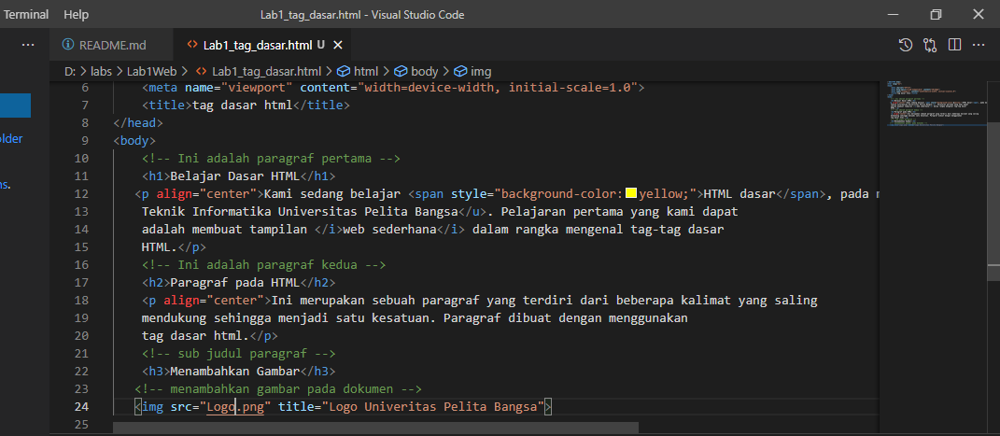

# Nama : Nahrul Wijaya
# nim : 312010415
# Kelas : TI.20.A1
# Matkul : Pemograman Web
# Belajar HTML dasar
# Langkah_Langkah Praktikum
Nama saya Nahrul disini saya akan menjelaskan tentang membuat web dengan HTML
pertama siapkan  VSCODE dan Browser

 Kemudian buat file baru dengan nama <b> Lab1_tag-dasar.HTML

Selanjutnya buka file tersebut menggunakan browser.Disini saya menggunakan <b> Google Chrome </b>

## 1. Membuat Paragraf Baru

Buatlah paragraf baru sederhana seperti berikut ini.dan kemudian lihat hasilnya dengan menrefresh pada web browser
sebelum jadi

## Hasilnya

Simpan dan lihat perubahan

## 3. Memformat Teks

Lakukan performatan teks yang ada pada paragraf yang sudah ada pada paragraf yang sudah ada sebelumnya, mengacu kepada penjelasan materi pemformatan teks sehingga tampilannya akan berbeda seperti berikut.
masukan code teks seperti berikut untuk melihat perubahan

Dan hasilnya akan seperti ini

## 4. Menyisipkan gambar

untuk menisipkan gambar,siapkan terlebih dahulu gambar yang ingin dimasukan pada HTML dan sisipkan atau taruh mgambar pada satu folder dengan HTML seperti gambar Berikut:

Kemudian tambahkan tag img setelah paragraf kedua, dengan menambahkan Heading 3 sebelumnya seperti berikut:

Gambar akan di tampilkan apa adanya sesuai ukuran aslinya.untuk mengatur ukuran gambar,dapat menggunakan atribut witdh dan height dengan nilai interget yang di sesuaikan seperti contoh diatas.nanti gambar akan seperti berikut ini:

## 5. Menambahkan Hyperlink

Tambahkan Hyperlink pada dokumen sebelum heading 1 seperti gambar berikut:

Nanti Hyperlink akan berada diatas seperti gambar berikut:

